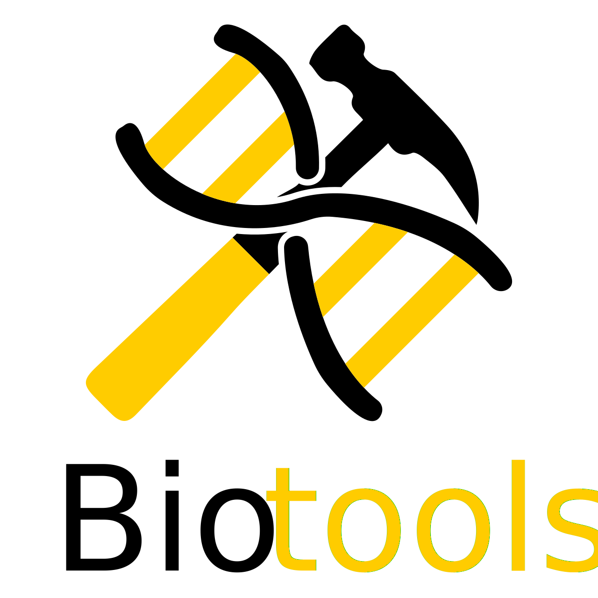
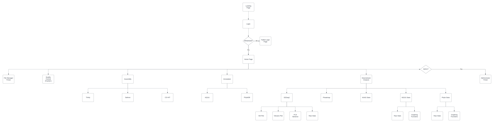

By: Reis Mercer Gadsden\
Current Version: v0.0b\
<a href="https://biotools-test2.azurewebsites.net">Site</a>\
<a href ="https://github.com/Fenwicks-Capstoners/capstone-biotools">Github</a>
## This project is in a work in progress and subject to change.

---

# Table of Contents
1. [Introduction](#hello)
2. [Azure Pipeline](#pipe)
3. [Storage & User Roles](#storage)
4. [Available Tools](#tools)
5. [Tool Requirements](#require)
6. [Website Wireframe](#frame)
7. [Detailed Page Breakdown](#pages)

---

# Introduction <a name ="hello"></a>
Biotools aims to remove the prerequisite of knowledge of bash and the command line needed to use many of the tools available for RNA sequence analysis. Biotools will allow users to store their files on a web server and pass them through various tools. These tools include FastQC, Trinity, CD-HIT, and Salmon. Biotools will also include functional and taxonomic annotation functionality via KEGG and PhyloDB. It will also include various downstream analysis functions such as Pheatmap, KEGG Pathview, KAAS analysis, KEGG analysis, PhyloDB analysis, and many of the functionalities found within the DESeq2 R package. The goal of Biotools is to make RNA Sequencing workflow more accessible to biologists who lack knowledge of Computer Science concepts relevant to RNA Sequencing and bioinformatics.

---

# Azure Pipeline <a name="pipe"></a>
## User Authentication
Users will authenticated through Azure AD. Ideally through DUO push.

## Storage Blob
Using an Azure storage blob, along with a whitelist of users, storage containers will be created for each user on the whitelist. On the website there will be a file management section which will display the hierarchy of their storage account similar to a file explorer.

## Computation with VM
A virtual machine or virtual machine will be loaded with the necessary requirements for all tools to run. Files will be moved from the users container to the virtual machine where the choosen operation will be performed. The output of the process will result in the normal output being stored in a user specified location within the user's container. In addition logs of the job will be in a job logs directory stored at the home location of the user.

---

# Storage & User Roles <a name="storage"></a>
## Storage
Since the goal of this project is to make this accessible the ideal way to represent the storage would mirror that of an actual local file system. A diagram of how to represent this is shown below:
```
/ (Root)
|
|-- User1 (User Account)
|   |-- Dir1
|   |   |-- File1
|   |   |-- File2
|   |-- Dir2
|   |   |-- File3
|   |   |-- File4
|   |   |-- File5
|   |   |   |-- Dir21
|   |   |   |   |-- File6
|   |-- Dir3 (empty directory)
|
|-- User2
|   |-- Dir1
|   |   |-- File1
|   |-- Dir2
|   |   |-- File2
|
|
.
.
.
```
However Azure Blob storage does not actually have a way to nest directories and files like a conventional file system does. A way to work around this is to simply name the individual blobs as their full path. An example of how this would look like within the actual storage account is shown below.
```
/ (Storage Account)
|
|-- User1 (Container)
|   |-- User1/Dir1/File1 (blob)
|   |-- User1/Dir1/File2 (blob)
|   |-- User1/Dir2/File3 (blob)
|   |-- User1/Dir2/File4 (blob)
|   |-- User1/Dir2/File5 (blob)
|   |-- User1/Dir2/Dir12/File6 (blob)
|   |-- User1/Dir3 (blob with 0 bytes, used to simply render empty directory)
|
|-- User2 (Container)
|   |-- User2/Dir1/File1 (blob)
|   |-- User2/Dir2/File2 (blob)
.
.
.
```
With this naming convention it should be possible to render the items as if it was a hierarchical structure.

## User Roles
Different user roles will be defined on the site in order to allow collaboration between students, and/or allow instructors to be able to view and modify students' work. Currently the proposed user roles from lowest to highest permissions are as follows:

### User
The standard user role. This role will have the following permissions:
* Can access their own user container, access to root is prohibited, access to other users containers is prohibited.
* Can upload, download, read, write, delete, and modify any blob within their container.

### Group Manager
This would be the role used for students that will be collaborating or for instructors looking to provide oversight to their students. This role will have the following permissions:
* Can access their own container, as well as other users' containers. The other users' containers that they have access to will be defined in the whitelist file. In a hierarchical structure this would inadvertently give them access to the root, however this is a non issue using blob storage as we just give them access to multiple containers.
* Can upload, download, read, write, delete, and modify any blob within a container they have access to.
* For students collaborating we would just need to give them access to one another's containers.

### Admin
This would be the role used for the site administrator, this account would have the highest permissions and ideally would be separate from any one user's account. This role will have the following permissions.
* Can access all containers.
* Can upload, download, read, write, and modify any blob.

This role will have the following permissions outside of the storage account:
* Will have access to the Admin webpage which will only render and can only be accessed if the user is logged in with the admin account.
    * Features of the Admin webpage are outlined in the Detailed Page Breakdown section.
* Can access the Azure account for the web application with full permissions.
    * If in the future this project is maintained by more than one person these permissions can also be delegated to user accounts with restrictions.
* Can access the Github repository for the web application.
    * If in the future this project is maintained by more than one person these permissions can also be delegated to user accounts with restrictions.

### Potential Role: Visitor
This a potential role for the future however will not be implemented at this time. The point of this role would be to allow an account that is outside of the universities AD to be able to access specified containers in order to incentivize collaboration across universities. If this role is implemented it would have the following permissions:
* Access specified user containers
* Can download and read any blob, however do not allow them to modify any blobs in a container in any way.
    * Cannot delete blobs.
    * Cannot create blobs.
    * Cannot run any tools.

## Whitelist file
The whitelist file will be a file stored on the backend of the website that defines whitelisted users, their roles, and their container permissions; this could be done simply in a json file. An example of this is given below:
```
Users: {
    User1: {
        "role": "admin",
        "containers" : ["*"]
    },
    User2: {
        "role": "user",
        "containers": ["User2"]
    },
    User3: {
        "role": "user",
        "containers": ["User3"]
    },
    User4: {
        "role": "user",
        "containers": ["User4"]
    },
    User5: {
        "role": "group-manager",
        "containers": ["User2", "User3", "User5"]
    },
    User6: {
        "role": "group-manager",
        "containers": ["User2", "User4", "User6"]
    }
}
```

---

# <a name="tools"></a> Available Tools
## Transcriptome Assembly
### <a href="https://www.bioinformatics.babraham.ac.uk/projects/fastqc/">FastQC</a>
*"FastQC aims to provide a simple way to do some quality control checks on raw sequence data coming from high throughput sequencing pipelines. It provides a modular set of analyses which you can use to give a quick impression of whether your data has any problems of which you should be aware before doing any further analysis. "*
### <a href="https://github.com/trinityrnaseq/trinityrnaseq">Trinity de Novo Assembly</a>
*"Trinity, developed at the Broad Institute and the Hebrew University of Jerusalem, represents a novel method for the efficient and robust de novo reconstruction of transcriptomes from RNA-seq data. Trinity combines three independent software modules: Inchworm, Chrysalis, and Butterfly, applied sequentially to process large volumes of RNA-seq reads.."*
### <a href="https://sites.google.com/view/cd-hit">CD-HIT</a>
*"CD-HIT is a very widely used program for clustering and comparing protein or nucleotide sequences. CD-HIT was originally developed by Dr. Weizhong Li at Dr. Adam Godzik's Lab at the Burnham Institute (now Sanford-Burnham Medical Research Institute). CD-HIT is very fast and can handle extremely large databases. CD-HIT helps to significantly reduce the computational and manual efforts in many sequence analysis tasks and aids in understanding the data structure and correct the bias within a dataset."*

## Abundance Estimation
### <a href="https://salmon.readthedocs.io/en/latest/index.html">Salmon</a>
*"Salmon is a tool for wicked-fast transcript quantification from RNA-seq data. It requires a set of target transcripts (either from a reference or de-novo assembly) to quantify. All you need to run Salmon is a FASTA file containing your reference transcripts and a (set of) FASTA/FASTQ file(s) containing your reads. Optionally, Salmon can make use of pre-computed alignments (in the form of a SAM/BAM file) to the transcripts rather than the raw reads."*

## Annotation
### <a href="https://github.com/bbuchfink/diamond">Diamond</a>
*"DIAMOND is a sequence aligner for protein and translated DNA searches, designed for high performance analysis of big sequence data."*
### <a href="https://www.kegg.jp/">KEGG</a>
*"KEGG is a database resource for understanding high-level functions and utilities of the biological system, such as the cell, the organism and the ecosystem, from molecular-level information, especially large-scale molecular datasets generated by genome sequencing and other high-throughput experimental technologies."*
### <a href="https://github.com/Lswhiteh/phylodbannotation">PhyloDB</a>
*"PhyloDB is* **[a]** *custom database suitable for comprehensive annotation of metagenomics and metatranscriptomics data. It is comprised of peptides obtained from KEGG, GenBank, JGI, ENSEMBL, and various other repositories. The database also contains all data from the Marine Microbial Eukaryotic Transcriptome Sequencing Project*

## Downstream Analysis
### <a href="https://bioconductor.org/packages/release/bioc/vignettes/DESeq2/inst/doc/DESeq2.html">DESeq2</a>
*"The package DESeq2 provides methods to test for differential expression by use of negative binomial generalized linear models; the estimates of dispersion and logarithmic fold changes incorporate data-driven prior distributions."*
### <a href="https://www.rdocumentation.org/packages/pheatmap/versions/1.0.12/topics/pheatmap">Pheatmap</a>
An R package that renders heat maps to highlight the differential expression of transcripts.
### <a href="https://www.bioconductor.org/packages/devel/bioc/vignettes/pathview/inst/doc/pathview.pdf">KEGG Pathview</a>
*"Pathview (Luo and Brouwer, 2013) is a stand-alone software package for pathway based data integration and visualiza-
tion. This package can be divided into four functional modules: the Downloader, Parser, Mapper and Viewer. Mostly
importantly, pathview maps and renders user data on relevant pathway graphs."*
### <a href="https://github.com/reismgadsden/KEGGStats">KEGG Stats</a>
A Python package that can break down PhyloDB annotation in order to return to statistics and visualizations for functional annotation.
### <a href="https://github.com/reismgadsden/PhyloStats">Phylo Stats</a>
A Python package that can break down PhyloDB annotation in order to return to statistics and visualizations for taxonomic annotation.
### <a href="https://github.com/reismgadsden/KAASStats">KAAS Stats</a>
A Python script that breaks down files that can be obtained by <a href="https://www.genome.jp/kegg/kaas/">KAAS</a> (KEGG Automatic Annotation Server). In order to return statistics and visualizations for functional annotation.

---

# <a name="require"></a> Tool Requirements
## FastQC
* JRE *(Java Runtime Environment)*
* Picard SAM/BAM Libraries

## Trinity
There is a docker image for this so it might be possible to just run from that. If not I am awaiting a reply from the creator of Trinity on the exact software requirements. The software that the docker image installs can be found <a href="https://github.com/trinityrnaseq/trinityrnaseq/blob/master/Docker/Dockerfile">here</a>.

## CD-HIT
* zlib Library

## Salmon
This one also has a docker image if that can be done as it is easier than installing needed requirements.
* C++ 11 compiler (gcc)
* CMake

## Diamond
* gcc

## KEGG
* Python

## PhyloDB
* Python

## DESeq2
* R

## Pheatmap
* R

## KEGG Pathview
* R

## KAAS Stats
* Python

## Phylo Stas
* Python

## KEGG Stats
* Python

---

# <a name="frame"></a>Website Wireframe
The following is a UML diagram showing the general layout of the website. (This image is quite long you might need to zoom in)

Two items that are missing from this is the Documentation page and the KEGG pathview page. These are not in the diagram as the site I made the diagram on had a limit on the total shapes allowed in a diagram.

---
# <a name="pages"></a>Detailed Page Breakdown
## Landing Page
The landing page will simply be a splash screen containing some nice (royalty-free or handmade) graphics, a short description of Biotools, and a login button that will prompt an Azure login via Appalachian State University credentials and DUO 2FA.

## Login
This page is external from the website, it is simply the Azure user authentication.

## Login Failed
This page will appear if a user is authenticated by Azure but is not present on the whitelist. This page will be the same as the landing page however instead of a short description and login button, there will be a message letting users know they are not whitelisted and to contact the site administrator.

## Home Page
This page will be similar to the landing page except it will lack a login button and the menu bar will contain more items.

## File Manager
This page will render out the current user's containers that they have access to in a similar fashion that file explorer would show them. From here users will be able to upload new files, download existing files, rename files or directories, move files, and delete files or directories.

## Quality Control
This page will contain the necessary and optional text fields that users will fill in order to pass data and clean data with FastQC.

Options:
* *\<files[]>* Input files
* *\<dir>* Output directory 

Output:
* Cleaned FASTQ files

## Trinity
This page will contain the necessary and optional text fields that users will fill in order to pass data to assemble with Trinity.

Options:
* *\<files[]>* Left input reads
* *\<files[]>* Right input reads
* *\<files[]>* Single input reads *(can only be chosen if left and right are left empty)*
* *\<dir>* Output Directory *(default = ~/Trinity_Ouput)* 

Outputs:
* Trinity.fasta
* Several logs

## Salmon
This page will contain the necessary and optional text fields that users will fill in order to pass data for abundance estimation to Salmon. Salmon requires and index to run however this will be created at runtime, not separately.

Options:
* *\<dir>* Index directory *(default = ~/salmon_index)*
* *\<dir>* Output directory *(default = ~/salmon)*
* *\<files[]>* Input files
* *\<string>* Library Type *(default = A)*

Outputs:
* Several quantification files *(one for each input file)*
* Command line info JSON
* Several Auxiliary files

## CD-HIT
This page will contain the necessary and optional text fields that users will fill in order to pass data for clustering with CD-HIT.

Options:
* *\<file>* Input file
* *\<file>* Output file
* *\<integer>* Number of words *(default = 10)*
* *\<float>* Sequence identity threshold *(default = 0.9)*
* *\<integer>* Description length *(default = 20)*

Output:
* Clustered assembly .fa file

## KEGG
This page will contain the necessary and optional text fields that users will fill in order to pass data for functional annotation with KEGG.

Options:
* *\<file>* Input file
* *\<file>* Output .fa file
* *\<file>* Output .tsv file
* *\<file>* Output .m8 File
* *\<float>* Minimum e-value *(default = 0.001)*
* *\<integer>* Maximum target sequences *(default = 25)*

Outputs:
* An annotated .fa file
* A .tsv containing annotation information
* A .m8 file

## PyhloDB
This page will contain the necessary and optional text fields that users will fill in order to pass data for taxonomic annotation with PhyloDB.

Options:
* *\<file>* Input file
* *\<file>* Output .fa file
* *\<file>* Output .tsv file
* *\<file>* Output .m8 File
* *\<float>* Minimum e-value *(default = 0.001)*
* *\<integer>* Maximum target sequences *(default = 25)*

Outputs:
* An annotated .fa file
* A .tsv containing annotation information
* A .m8 file

## DESeq2
### Volcano Plot
### MA Plot
### PCA Variance
### Raw Stats
## Pheatmap
## KEGG Pathview
## KAAS Stas
## KEGG Stats
### Raw Stats
### Graphing Functionality
## Phylo Stats
### Raw Stats
### Graphing Functionality
## Documentation
## Administrator Portal